# Frontend Mentor - Space tourism website solution

This is a solution to the [Space tourism website challenge on Frontend Mentor](https://www.frontendmentor.io/challenges/space-tourism-multipage-website-gRWj1URZ3). Frontend Mentor challenges help you improve your coding skills by building realistic projects.

## Table of contents

- [Overview](#overview)
  - [The challenge](#the-challenge)
  - [Screenshots](#screenshots)
  - [Links](#links)
- [My process](#my-process)
  - [Built with](#built-with)
  - [Useful resources](#useful-resources)
  - [Deployment](#deployment)
- [Author](#author)

## Overview

### The challenge

:white_check_mark: View the optimal layout for each of the website's pages depending on their device's screen size

:white_check_mark: See hover states for all interactive elements on the page

:white_check_mark: View each page and be able to toggle between the tabs to see new information

### Screenshots

#### Desktop

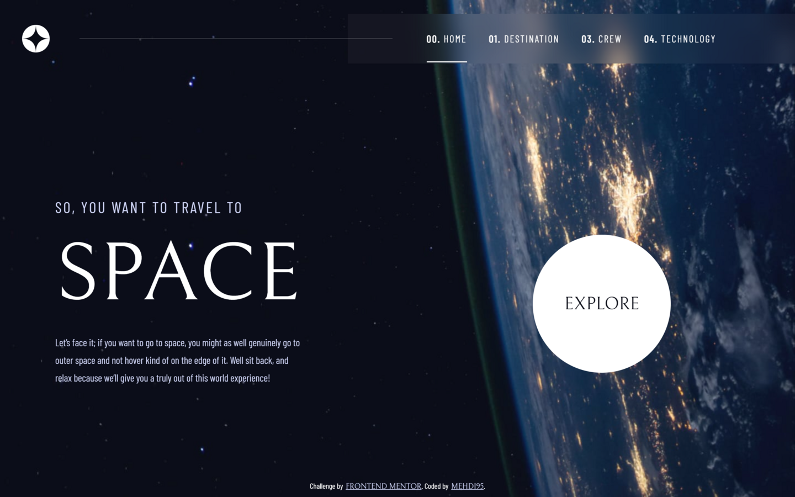
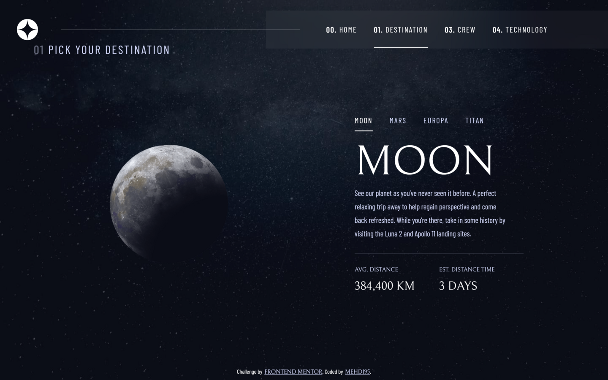
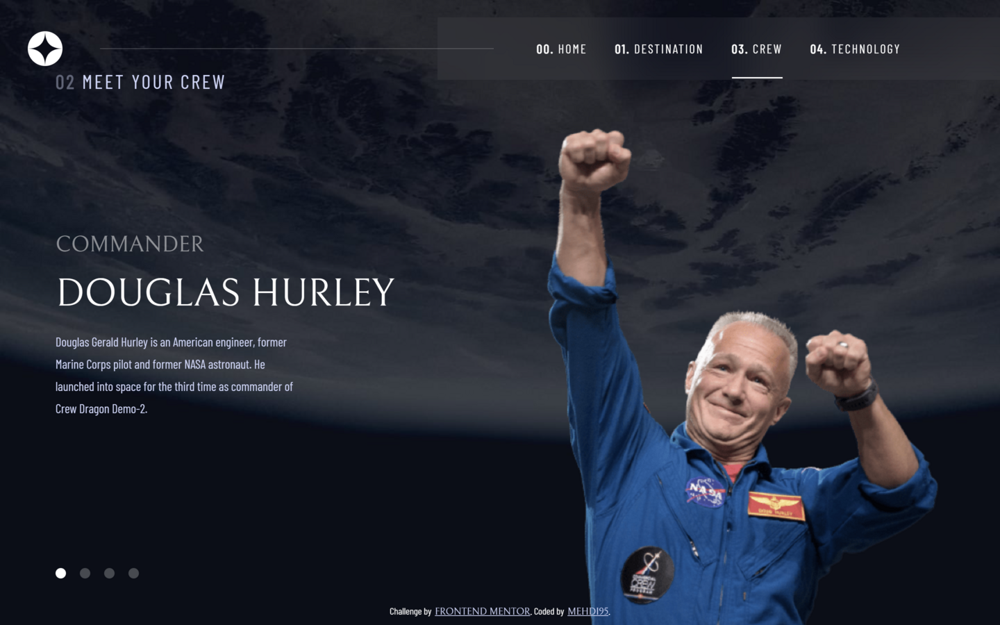
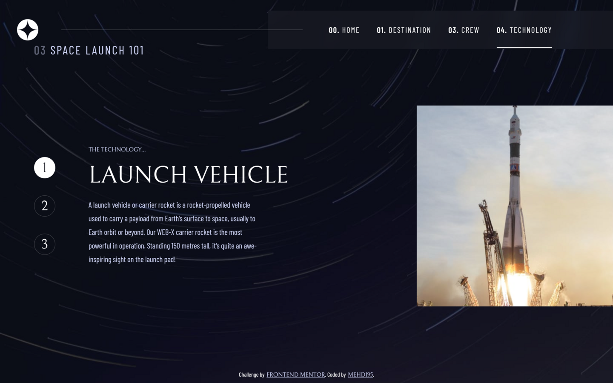

#### Tablet

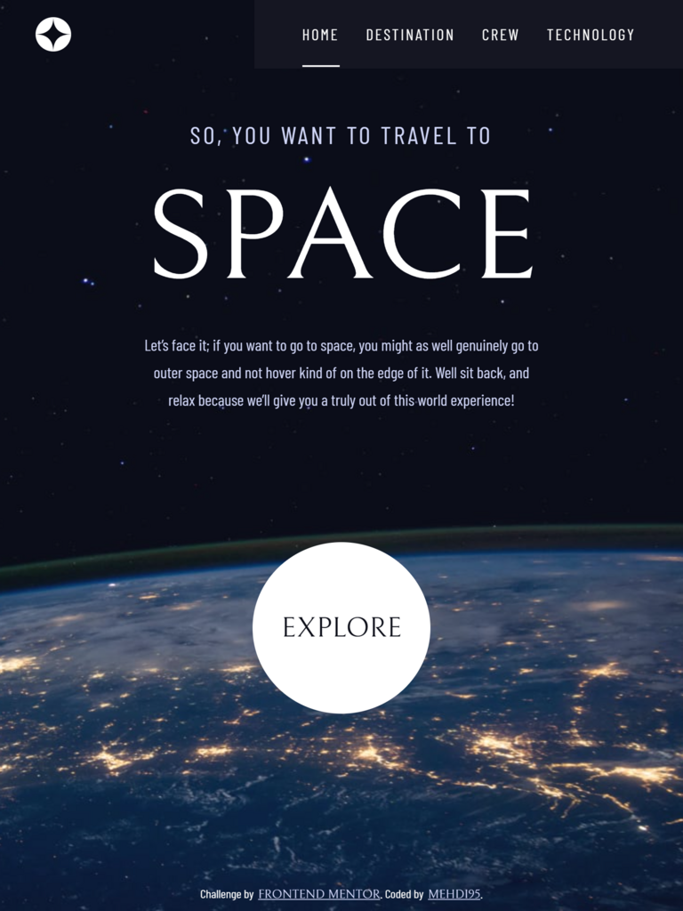
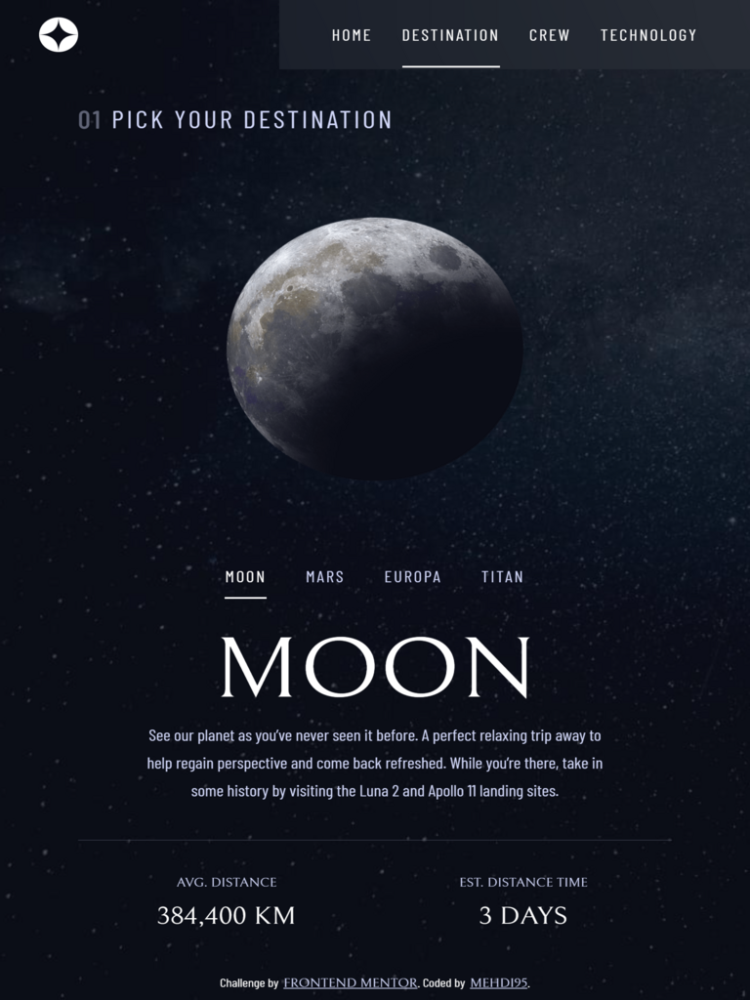
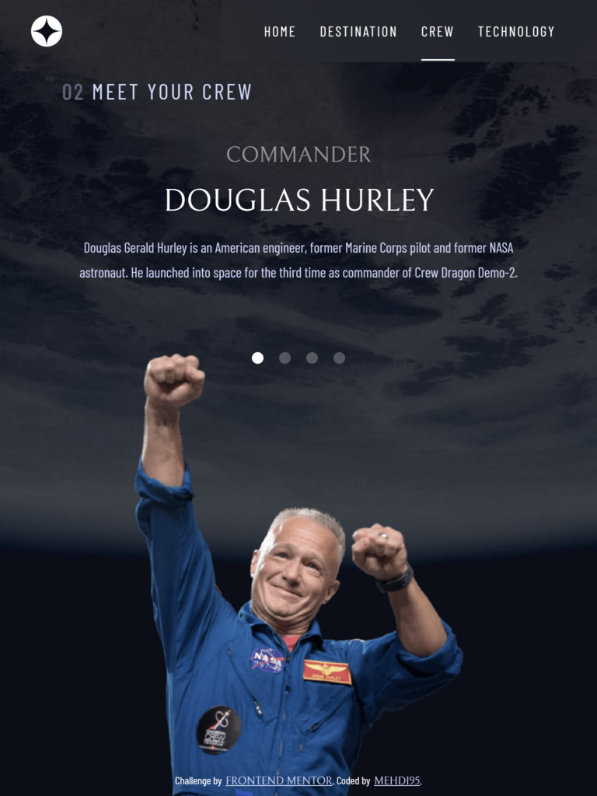
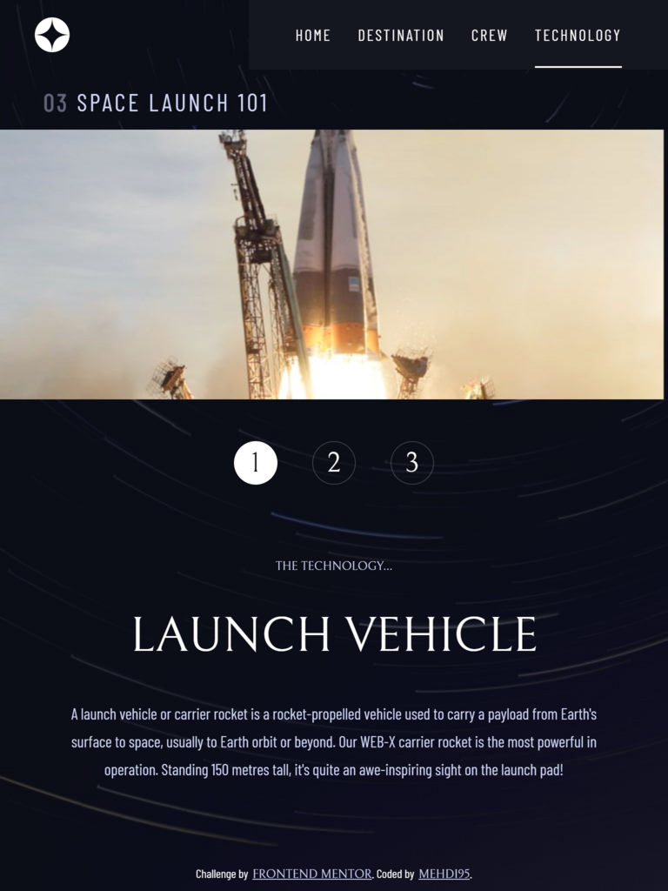

#### Mobile

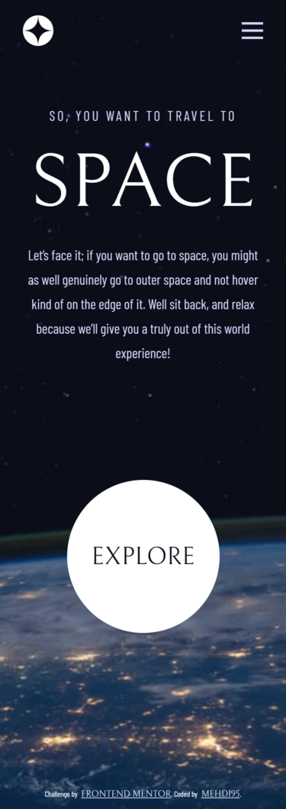
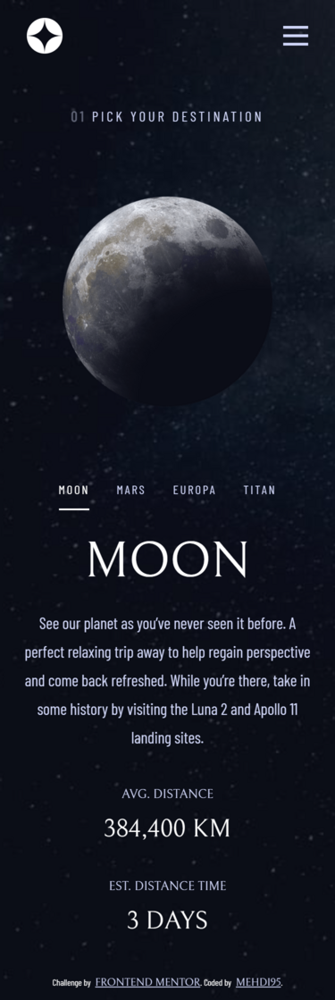
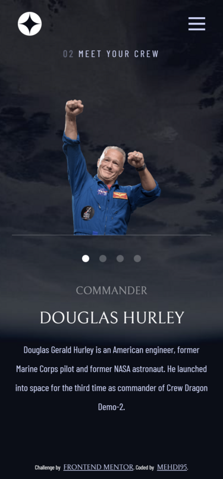
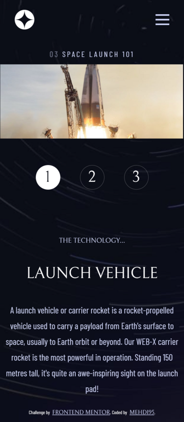
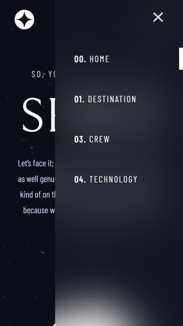

### Links

- Solution URL: [HERE](https://www.frontendmentor.io/solutions/spacetourismwebsite-using-react-sass-B9Nk4H7wFM)
- Live Site URL: [HERE](https://storied-caramel-0c0a6c.netlify.app/)

## My process

### Built with

- Semantic HTML5
- Sass
- Flexbox
- React
- Media Queries

### Useful resources

- [React Docs](https://reactjs.org/docs/getting-started.html)
- [Sass Docs](https://sass-lang.com/documentation)

## Deployment

- [Netlify](https://www.netlify.com)

## Author

- Frontend Mentor - [@MBenmasour95](https://www.frontendmentor.io/profile/MBenmasour95)
